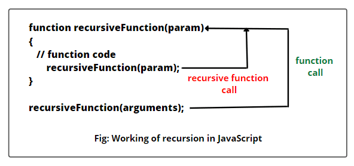

# __Что такое *"Recursion"* в **JavaScrupt**__
*Recursion* - это функция которая внутри себя может снова вызвать себя, эта операция может продолжатся вечно поэтому нам нужно поставить такие условия как: *if*, *while*, *do while*, и когда условие совершится этот цикл прекратится. Пример бесконечного recursion:

Представить рекурсию проще всего на примере зеркального коридора — когда напротив друг друга стоят два зеркала. Если посмотреть в одно, то в нём будет отражение второго, во втором — отражение первого и так далее.

В «Начале» Нолана есть момент с зеркальным коридором, когда в отражении зеркала видно отражение зеркала, в котором видно отражение зеркала, в котором видно...

Второй пример, чуть более академически правильный — это фрактал. Тот же треугольник Серпинского — это пример рекурсии, потому что часть фигуры — это одновременно вся фигура.

# __Что такое *"Clouser"* в **JavaScrupt**__
*Clouser* - это комбинация функции и лексического окружения, в котором эта функция была определена. Другими словами, замыкание даёт вам доступ к Scope (en-US) внешней функции из внутренней функции. В JavaScript замыкания создаются каждый раз при создании функции, во время её создания.

init() создаёт локальную переменную name и определяет функцию displayName(). displayName() — это внутренняя функция — она определена внутри init() и доступна только внутри тела функции init(). Обратите внимание, что функция displayName() не имеет никаких собственных локальных переменных. Однако, поскольку внутренние функции имеют доступ к переменным внешних функций, displayName() может иметь доступ к переменной name, объявленной в родительской функции init().

